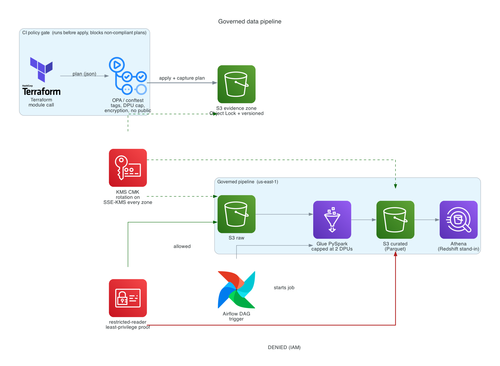

# Governed data pipeline

A Terraform module that stamps out an S3 to Glue to Athena pipeline with tagging, a cost ceiling, encryption, least-privilege IAM, and TLS enforcement already wired in. A policy gate in CI refuses to ship a pipeline that skips any of them.

## The problem

On a growing data team, everyone tends to build pipelines their own way. One person ships an oversized Glue job, another forgets a bucket policy, a third leaves resources untagged so nobody can trace the bill later. None of it is careless. It happens because the safe way to stand up a pipeline takes longer than the quick way, and under a deadline the quick way wins.

Two things break because of that. Spend drifts, because there is no attribution and no ceiling, and a single mis-sized job can quietly run into the thousands before anyone notices. And in a regulated environment, an unencrypted or undocumented resource is not just untidy, it is an audit finding: an unrecorded change to a controlled system.

The root cause is not any one pipeline. It is that there is no standard, enforced way to build one, so the controls stay optional and optional controls get skipped.

## The solution

Make the safe path the only path. This repo is one Terraform module that provisions a full pipeline with every control already attached, plus a CI gate that fails the build the moment a plan violates one. An engineer calls the module and gets governance for free. They cannot produce an untagged, oversized, unencrypted, or publicly reachable resource through it, because the gate rejects the plan before anything is applied.

What the module builds:

- Three S3 zones (raw, curated, scripts). Each one gets SSE-KMS encryption, a public-access block on all four settings, and a bucket policy that denies any request not made over TLS.
- One customer-managed KMS key with rotation on, used across every zone, so the key policy and rotation are ours to control rather than the account default.
- A Glue PySpark job capped at 2 DPUs, on an IAM role scoped to only the buckets and the one key it actually touches.
- An Athena database over the curated zone. It stands in for Redshift and costs almost nothing to query.
- An Object-Locked, versioned evidence bucket. Every deploy writes its Terraform plan there, where it cannot be overwritten or deleted.
- A restricted-reader IAM role that exists only to prove least privilege is real, not asserted.

The transform itself is deliberately small: read raw CSV, drop empty rows, add a load timestamp, write Parquet partitioned by date. The pipeline is the point, not the ETL.

## Architecture



The diagram is generated from code (`docs/architecture.py`, official AWS icons via the `diagrams` library) so it stays in sync with the module. Text fallback:

```
   sample data
       |
       v
  +-----------+      +-------------------+      +----------------------+
  |  S3 raw   | ---> |  Glue (PySpark)   | ---> |  S3 curated (Parquet)|
  +-----------+      +-------------------+      +----------------------+
       ^                     ^                            |
       |                     |                            v
  Terraform + KMS      triggered by an              Athena query layer
  (TLS-only policy)    Airflow DAG                  (Redshift stand-in)

  Every zone:      SSE-KMS at rest, public-access-block, DenyInsecureTransport
  Evidence zone:   Object-Locked and versioned. Each deploy's plan lands here.
  CI gate:         conftest/OPA blocks tags, cost, encryption, and public-access
                   violations at the pull request, before apply.
```

## Compliance mapping

This is a reference lab, not a certified system, but each control is the concrete implementation of a requirement that a regulated SaaS lives under. The columns below tie each one to SOC 2 Type II, ISO 27001 (and 27017/27018 for cloud), and GxP change-control expectations, including the 21 CFR Part 11 audit-trail requirement.

| Control | How it is implemented | What it satisfies |
|---|---|---|
| Attribution | `default_tags` on the provider; the gate rejects any untagged resource | SOC 2 accountability, FinOps ownership |
| Cost ceiling | per-tier Glue DPU cap (2 by default, tighter for prod); the gate rejects an oversized job | operational discipline, spend control |
| Encryption at rest | one CMK, SSE-KMS on every zone, rotation enabled | SOC 2 CC6.1, ISO 27001 cryptography, "AES 256 encryption at rest" |
| Encryption in transit | `DenyInsecureTransport` on every bucket | SOC 2 CC6.7, TLS 1.2 minimum |
| No public data | public-access-block, all four settings, on every zone | SOC 2 CC6, data confidentiality |
| Least privilege | scoped IAM per role; a restricted-reader role proves it live | SOC 2 CC6.3, "least privileged access enforced through automated means" |
| Change control | Object-Locked evidence zone captures every deploy's plan | SOC 2 CC8.1 change management, GxP / 21 CFR Part 11 audit trail |
| Enforcement | conftest gate in CI blocks all of the above at the PR | SOC 2 CC8.1, controls that cannot be skipped |

The point of the last row is that the same gate that stops a surprise bill also produces the record change-control needs. Cost hygiene and compliance turn out to be one control, not two.

## Enforcement, and how to see it

The gate runs twice: once locally before you push, once in CI on the pull request. It reads the Terraform plan as JSON and checks tags, a per-tier Glue DPU ceiling, encryption on every bucket, no public access, and a prod-only evidence-retention floor. `policy/tags.rego` holds the rules.

To watch it fail on purpose, bump the Glue job past 2 DPUs, remove an encryption block, or flip a public-access flag, then run `make gate`. The plan is rejected before a dollar is spent or a bucket is exposed.

Two of the controls are also proven in the live account by `make verify`:

- TLS only. A plain-HTTP request to a zone returns `403`, denied by the bucket policy.
- Least privilege. The restricted-reader role reads the raw zone (the positive control) but is denied on curated. The denial is an IAM decision, not an encryption artifact, because the role holds `kms:Decrypt`. Least privilege is demonstrated, not claimed.

## Running it

```bash
make init       # terraform init
make gate       # plan, infracost, then the conftest policy check (cost and security)
make deploy     # terraform apply, then capture the plan into the evidence zone
make demo       # upload sample data, run the Glue job
make verify     # prove TLS-only and least privilege in the live account
make destroy    # sweep the Object-Locked evidence zone, then terraform destroy
```

These run against the `sandbox` tier by default; pass `ENV=dev|test|prod` to target another (see Environments below).

Prerequisites: AWS credentials (region defaults to `us-east-1`), Terraform, the AWS CLI, `conftest`, `python3` with `boto3` for the teardown sweep, and `curl`. The caller must be able to assume the restricted-reader role, which any account admin can. `infracost` is optional; the gate skips it cleanly if it is not installed.

## Environments (sandbox / dev / test / prod)

The pipeline is one reusable module, so every tier is the same module promoted
per tier, not a copy. Each tier gets its own Terraform workspace (separate state,
real isolation) and its own var-file under `terraform/envs/`, and the environment
name is baked into every resource name so tiers never collide even in a single
account. In a real Veeva-style layout each tier is a separate AWS account and the
account id already disambiguates.

Every `make` target takes an `ENV`, which defaults to `sandbox`:

```bash
make gate ENV=dev      # plan + policy check against the dev tier
make deploy ENV=prod   # apply the prod tier into its own workspace
make destroy ENV=test  # tear down just the test tier
```

The policy gate is tier-aware: it reads the `environment` tag and tightens by
tier. dev allows a higher Glue DPU ceiling for experimentation; test and prod
are capped tighter; and prod, as a validated environment, additionally requires
the Object-Lock evidence retention to clear an audit floor. So the same gate that
blocks the accidental $15k job also enforces stricter change-control on prod than
on dev, which is exactly what a GxP / SOC 2 shop needs.

## Cost

Multi-environment structure (the var-files, workspaces, and tier-aware gate) adds
no cost on its own; billing starts only when you `terraform apply` a given
environment. The one standing charge per live environment is its KMS key, about a
dollar a month, so three environments running at once is a few dollars a month
idle. You do not need them all live at once to prove the pattern.

Everything is serverless or local, and nothing is always-on. Left running for a full week the bill stays well under a dollar. S3 storage is pennies, the Glue job is a few cents per run at 2 DPUs, Athena is cents per query, and the Airflow DAG runs locally for free. The only standing charge is the KMS key at about a dollar a month. Athena instead of a Redshift cluster and local Airflow instead of MWAA (which would be roughly $350 a month for the same DAG) are deliberate choices: the idle cost was engineered down, not left to chance.

## Layout

```
terraform/                 provider default_tags, the module call, outputs
  envs/{sandbox,dev,test,prod}.tfvars  per-tier variables promoted through workspaces
  modules/pipeline/        the reusable module: KMS, S3 zones, hardening,
                           IAM, evidence zone, Glue job, Athena database
glue/transform_job.py      PySpark: raw CSV to curated Parquet
airflow/dags/              the DAG that triggers the Glue job, portable to MWAA
policy/tags.rego           the conftest/OPA gate: tags, cost, encryption, public access
scripts/purge_evidence.py  governance-bypass sweep so destroy can remove the locked zone
data/sample.csv            a small input so the demo runs in seconds
```

## Scope and limitations

This is a proof artifact, not a 17TB production system. The pattern holds at scale, but the rollout would sequence by blast radius and the Glue and warehouse tiers would be sized for real volume. The MWAA and Glue depth here is lighter than the S3, IaC, and policy depth on purpose: the module and the gate are the parts worth showing.
